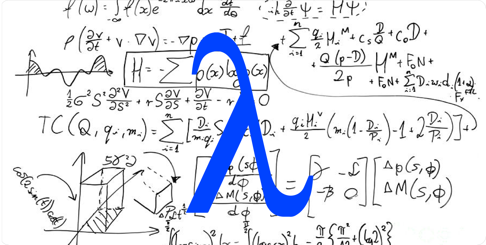

## Functional Programming in Python

#### By Vic Kumar | [https://github.com/vickumar1981/functional_python](https://github.com/vickumar1981/functional_python)

##### Salt Lake City, UT  |  PyCon 2022 | [Video](https://www.youtube.com/watch?v=x7sQVLO3JJA)

This presentation uses Jupyter notebooks.  You can either install jupyter locally or use a notebook in the cloud.

### Installing Jupyter Notebooks Locally

- `pip install notebook`
- Run: `jupyter notebook functional-python.ipynb`

**Note**:

If you use `pipx`, then the program is `jupyter-notebook`, i.e.:

`jupyter-notebook functional-python.ipynb`

### Viewing the Slide Show

- Run: `./run-slideshow.sh` (on Linux/Mac)
- Run: `jupyter nbconvert functional-python.ipynb --to slides --post serve` (on Windows)

### Using Jupyter Notebooks in the Cloud

Alternatively, you can use cloud based services and not have to install jupyter locally.

- [Google Collab](https://colab.research.google.com/)
- [Goto code](https://gotocode.io)

 
